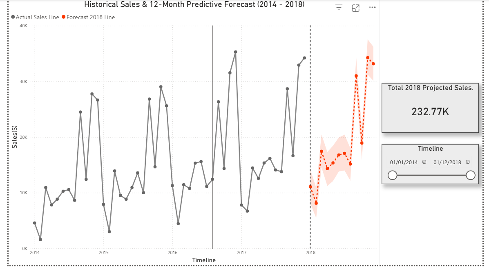

📈 12-Month Sales Forecasting: Predictive Strategy via FB Prophet
📌 Executive Summary
This project shifts the business from reactive reporting to proactive planning. By implementing a Facebook Prophet forecasting model, I analyzed four years of historical sales data (2014-2017) to generate a statistically sound 12-month rolling forecast. This enables leadership to anticipate market fluctuations, optimize inventory, and set data-backed revenue targets for the 2018 fiscal year.

📊 Predictive Dashboard

Strategic Highlights:
2018 Revenue Projection: Predicted total sales of $232.77K.

Seasonality Detection: The model accurately identified and accounted for significant year-end (Q4) surges.

Risk Mitigation: Integrated 80% confidence intervals (yhat_upper/yhat_lower) to provide "Best Case" and "Worst Case" financial scenarios.

💡 Business Value & Application
1. Revenue Risk Management
By distinguishing "Actual" vs. "Forecast" segments, management can identify months with potential revenue gaps. This allows for the early deployment of marketing campaigns to ensure 2018 targets are met.

2. Operational Efficiency
The 12-month outlook allows the procurement and supply chain departments to align stock levels with predicted demand peaks, reducing unnecessary holding costs and eliminating stockout risks during high-growth periods.

🛠️ Technical Methodology
The project utilizes a hybrid approach, combining Python's modeling power with Power BI's visualization capabilities:

Data Engineering: Automated cleaning and datetime standardization using Pandas.

Predictive Modeling: Utilized the Prophet library to decompose the time-series into trend and seasonal components (monthly and yearly).

Feature Engineering: Developed a custom Type column to dynamically segment historical data from forecasted results for stakeholder clarity.

📂 Project Structure
stores_sales_forecasting.csv: Historical dataset (2014-2017).

Sales_Forecasting_Project.pbix: Power BI dashboard with integrated Python scripts.

Script.py: The Prophet modeling engine used for the prediction.

forecast_dashboard.png: High-resolution preview of the final analysis.

🚀 How to Replicate
Environment: Ensure Python 3.9+ is installed with pandas and prophet libraries.

Power BI Setup: Navigate to Options > Python scripting and point to your Python directory.

Execution: Open the .pbix file. The Python script will run automatically to generate the forecast based on the linked CSV.
